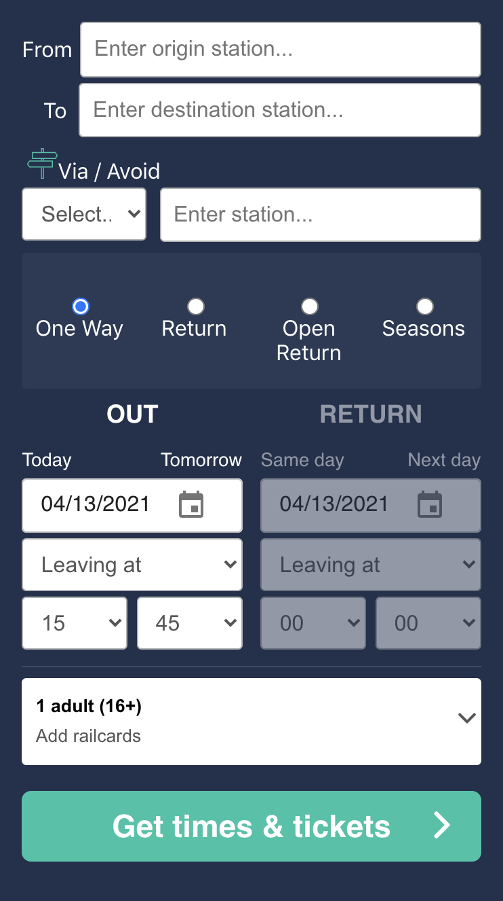

> # Tictactrip

TicTacTrip is the first multimodal comparator to combine different means of transport on the same journey. In just one search, see which is the cheapest between the bus, the train and the carpooling.

<hr>

> # Description About The Project

This projet is a recruitment Exo from Tictactrip trying on it to recreate a UX/FRONT of a search bar as close as possible to that of `https://www.trainline.eu`.

<hr>

> # Completion Time

About four days or less

<hr>

> # Front-end

- React.js (+hooks)
- Material-ui

<hr>

> ### How to run it ?

   1. cd client && npm install

   2. cd client && npm run Product

   3. Open browser and go to `http://localhost:3000`

<hr>

># Screenshots 

# Full Screen
 ```
 Home
 ```


# Responsive
 ```
 Home
 ```


<hr>